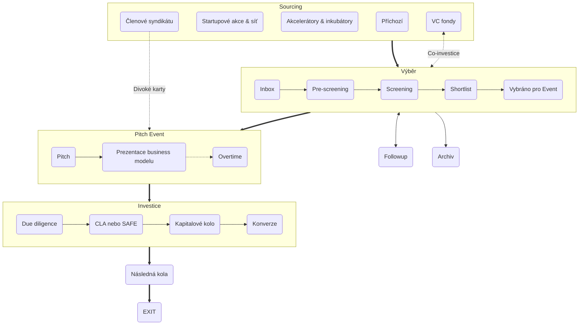

+++
title = "Jak investujeme?"
meta_title = "Jak investujeme?"
+++

Investiční proces Gluon Syndicate je navržen tak, aby podporoval transparentnost, spravedlnost a efektivitu, přičemž slaďuje zájmy jak zakladatelů, tak investorů. Ať už jste zakladatel hledající financování nebo investor zkoumající příležitosti, náš strukturovaný proces zajišťuje jasnost a hodnotu v každém kroku. Zde je jeho základní přehled:

 
#### 1. [Sourcing](https://kb.gluon.vc/Knowledge+Base/How+We+Invest/Sourcing)
Startupy získáváme z různých kanálů, včetně příchozích přihlášek, startupových akcí, partnerství s akcelerátory a inkubátory, doporučení od členů syndikátu a propojení s VC fondy.

#### 2. [Výběr](https://kb.gluon.vc/Knowledge+Base/How+We+Invest/Selection)
Startupy procházejí důkladným hodnotícím procesem, který zahrnuje pre-screening, screening a sestavení užšího seznamu před výběrem k prezentaci na jednom z našich čtvrtletních pitch eventoch.

#### 3. [Pitch Eventy](https://kb.gluon.vc/Knowledge+Base/How+We+Invest/Pitch+Events)
Startupy představují svou vizi a cíle v dvoukolové prezentaci, kde investoři vyjadřují zájem a činí závazky prostřednictvím naší aplikace.

#### 4. [Investice](https://kb.gluon.vc/Knowledge+Base/How+We+Invest/Investment)
Startupy, které dosáhnou svých investičních cílů, procházejí due diligence, po které jsou investice realizovány buď prostřednictvím [CLA (Convertible Loan Agreement)](https://kb.gluon.vc/Knowledge+Base/CLA+(Convertible+Loan+Agreement)) nebo [SAFE (Simple Agreement for Future Equity)](https://kb.gluon.vc/Knowledge+Base/SAFE+(Simple+Agreement+for+Future+Equity)).

#### 5. [Následná kola a exit](https://kb.gluon.vc/Knowledge+Base/How+We+Invest/Subsequent+Rounds+and+Exit)
Podporujeme startupy v jejich růstu a zajištění budoucího financování, přičemž využíváme naši síť k jejich propojení s institucionálními investory. Naším cílem je úspěšný exit, ať už akvizicí, IPO nebo jinými strategickými příležitostmi, s obvyklým investičním horizontem 7–10 let.


Podrobný popis každé fáze najdete v naší **[Znalostní bázi (EN)](https://kb.gluon.vc/)**


---