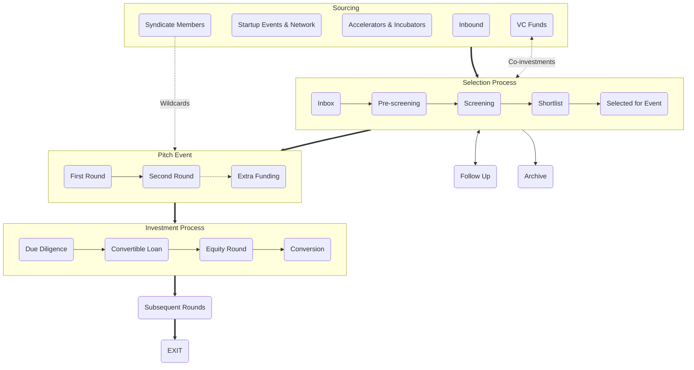

+++
title = "Jak investujeme?"
categories = [ "For Startups", "For Investors",]
tags = [ "process", "conditions", "policy", "raising capital", "sourcing", "selection", "event", "investment",]
meta_title = "Jak investujeme?"
+++

V Gluon Syndicate věříme, že transparentní a předem jasný investiční proces společne s férovými podmínkami jsou základními předpoklady zrodu kvalitního vztahu mezi zakladateli startupu a jejich investory. A rádi se obklopujeme stejně smýšlejícími lidmi. Proto na tomto místě najdou potenciální zájemci o investíci, stejně jako investoři, kteří zvažují možnost se k nám přidat, vše podstatné o tom, jak přistupujeme k investování.

 

## Sourcing

### Syndicate Members
Naši členové mají možnost navrhovat startupy hledající investici a ty následně prochází našim výběrovým procesem. Navíc - investoři s prémiovým členstvím mají právo jednou ročně nominovat přímo na event jeden startup, do kterého chtějí investovat a hledají co-investory. 

### Startup Events & Network
Aktivně vyhledáváme nadějné startupy napříč střední a východní Evropou formou osobních setkání na startupistických eventech a soutěžích i prostřednictvím online průzkumu. A díky široké síti kontaktů z řad founderů, investorů, novinářů a dalších startup nadšenců, kterou jsme si za 15 let v byznysu vybudovali, zůstáváme v obraze o aktuálním dění na startupistické scéně v regionu.

### Accelerators & Incubators
Vytvořili jsme a rozvíjíme partnerství s několika regionálními akcelerátory a inkubátory (AceON, StartupYard, InQb, SaaS Garden, atd.), přičem v některých z nich i přímo mentorujeme. Díky této spolupráci získáváme přístup k jejich nejlepším alumni startupům.

### Inbound
Aktivně promujeme aktivity a fungování syndikátu s cílem zasáhnout zakladatele nejzajímavějších early-stage startupů z regionu. Snažíme sa jasně odkomunikovat své principy a výhody, abychom byli mezi prvními, komu pošlou svůj pitch deck, ve chvíli kdy začnou hledat angel investici.

### VC Funds
Jsme v blízkém kontaktu s předními VC fondy ze CEE (Presto, Tensor, Kaya, 0100, Zaka, atd.) a ty k nám směrují startupy z jejich deal flow, které jim připadají zajímavé, ale jsou pro ně příliš early-stage. Navíc s námi vybrané VCs pravidelně sdílejí zajímavé koinvestiční příležitosti a recipročně my máme možnost některé naše příležitosti sdílet s nimi.

---

## Selection

### Inbox
Každá nová příležitost nám přistane do inboxu, nejčastěji na základě online přihlášky u nás na webu. Snažíme sa, aby foundeři ještě před vyplněním přihlášky znali fungování Gluon Syndicate a podmínky, za kterých investujeme. Do další fáze posouváme projekty, které splňují základní investiční kriteria (fáze projektu, objem plánované investice, očekávání founders, apod.)

### Pre-screening
V první fázi výběrového procesu hodnotíme odpovědi na otázky z prihlášky ohledem problému a jeho řešení, trhu a konkurence, inovativnosti konceptu, síly týmu, biznis modelu, atd. Projekty, které na první pohled vyhodnotíme jako zajímavé, posunujeme do další fáze.

### Screening
V druhé fázi výběrového procesu jdeme významně více do detailu prezentovaného byznysu. Analýza se skládá z rozšířené sady otázek a odpovědí a 30-60 minutového callu se zakladateli startupu. Na základě zjištění vybíráme startupy na shortlist, přičem vždy měsíc před pitch eventem chceme mít na shortlistu 30 nejzajímavějších startupů, které jsme za poslední kvartál viděli.

### Shortlist
Z 30 shortlistovaných startupů vybíráme 15 nejlepších, které dostanou příležitost zabojovat o investici na pitch eventu. O nominaci na každý event rozhoduje bodovací hlasování zakladatelů a VIP členů Gluon Syndicate, které probíhá prostřednictvím vlastní online platformy. Nominace na event jsou známy 14 dní před jeho uskutečněním.

### Selected for event
Se startupy vybranými na event předem podepisujeme základní investiční dokumentaci - smlouvu o konvertibilní půjčce (CLA) - tak aby všechny podmínky byly jasné a zakotvené ještě před pitch eventem (nejdůležitější parametry naší standardizované CLA najdete zde). Součástí této smlouvy je aktivační klauzule, která spustí investiční proces za dohodnutých podmínek, pokud se zakladatelům startupu podaří na pitch eventu naraisovat prostředky v hodnotě investičního cíle, který si předem sami určí (v rozsahu €50-300k). 
NB: Startup za účast na eventu ani za případnou realizaci investice a s tím související činnosti neplatí žádné poplatky.

---

## Pitch Event

### First round
V první části eventu mají postupně všechny startupy na stagi 5-minutový prostor na pitch. Kromě toho mají foundeři od začátku eventu k dispozici vlastní prezentační stánek. Od zahájení eventu mohou všichni přítomní investoři vyjádřit předběžný zájem investovat do konkrétního startupu zadáním indikativního ticketu v konkrétní výši do mobilní aplikace. Kvantifikovaný předběžný zájem o investice do všech startupů je vizualizován na displejích. Na konci prvního kola se vyhodnotí předběžný zájem a 6 startupů s největší indikovanou částkou postupuje do druhého kola na stagi (nepostupující startupy nadále mohou naraisovat během eventu své cíle, jen už nedostávají další prostor na stagi).

### Second round
Ve druhém kole dostává 6 startupů s nejvyšší částkou kvantifikovaného zájmu o investici příležitost odprezentovat ve 20 minutách na stagi svůj byznys model (a případně i produktové demo). Na konci každé prezentace probíhá krátká Q&A session. Od začátku druhého kola mohou investoři konvertovat předběžný zájem na závaznou nabídku (a nadále mohou i libovolně vyjadřovat a měnit předběžné zájmy). Vyjádřením závazné nabídky získává startup příslib investice od daného investora. Investor tento svůj commitment digitálně podepisuje prostřednictvím mobilní aplikace. Pokud částka příslibů na eventu dosáhne, resp. překročí hranici investičního cíle, kterou si foundeři zadefinovali, investice se bude realizovat. Pokud se během eventu founderům nepodaří získat částku závazných nabídek na úrovni investičního cíle, žádná investice se nerealizuje a podepsaná CLA nevstoupí v platnost, ale zaniká.

### Extra funding
Zakladatelé jednotlivých startupů si předem určují kromě svého investičního cíle (který je zároveň prahovou hodnotou celé investice) i možnost naraisovat „extra funding“ ve výši 0-100% investičního cíle, tedy možnost až zdvojnásobit investici. Pokud úspěšný startup dosáhne hranici extra fundingu přímo na eventu, investiční příležitost se uzavírá a již není možné do startupu dále investovat. Pokud startup dosáhne na eventu svého investičního cíle, ale nedosáhne hranici extra fundingu, zůstane tato příležitost otevřena pro angel investory ještě 5 dní prostřednictvím mobilní aplikace (pokud se během tohoto období naplní extra funding, příležitost se v daném okamžiku zavře).
NB: Výše ​​valuation cap v CLA je závislá na stanoveném investičním cíli a extra funding na ni nemá žádný dodatečný vliv. Proto se foundeři před eventem musí rozhodnout, zda mají za daných podmínek zájem v případě dosažení cíle raisovat i extra funding a v jaké výši.

---

## Investment

### Due Diligence (DD)
Pokud se startupu na eventu podaří naraisovat vytyčený investiční cíl (případně i volitelný extra funding), zahájí se bezprostředně po eventu (resp. po ukončení období určeného pro extra funding) ostrá fáze investičního procesu. Ta začíná základním due diligence – tedy ověřením skutečností, které foundeři uvedli v průběhu procesu výběru. To trvá zpravidla několik dní. Ve fázi early-stage investic není DD proces tak obsáhlý a detailní jako v pozdějších investičních kolech a kontrolují se zejména bazální prerekvizity (corporate governance, cap table, důležité smluvní závazky startupu, forma ošetření IP a případně deklarovaná stávající trakce).

### Convertible Loan
Pokud jsou výsledky DD uspokojivé, Gluon Syndicate vytváří ve spolupráci se všemi zúčastněnými angel investory SPV (společnost určenou výhradně k investování do daného startupu), na kterou se následně přenese aktivovaná CLA. Angel investoři vkládají částky určené k investici do cílového startupu do nově vzniklé SPV formou vkladu do základního kapitálu a kapitálových fondů a získávají za to alikvotní podíl na SPV. Následně SPV posílá na základě CLA peníze cílovému startupu a stává se tak v první fázi jeho věřitelem. Od momentu odeslání peněz cílovému startupu se stávají zapojení angel investoři (zastupovaní Gluon Syndicate) investory v cílovém startupu a spouští se tak standardní investorsko-founderská spolupráce (kvartální reporting, pravidelný board meeting za účasti zástupců investora, mentoring a byznysová pomoc angelů, atd.).

### Equity round
Společným cílem zakladatelů i angel investorů je mimo jiné i realizace kvalifikovaného investičního (equity) kola, tedy příchod institucionalizovaných VC investorů do startupu (ideálně v horizontu několika měsíců až 1-2 let od angel investice). Gluon Syndicate jako skupina motivovaných angel investorů bude zakladatelům startupu aktivně pomáhat iv získání této první VC investice – propojením na relevantní VC fondy z regionu, představením a otevřením dveří k různým fundraisingovým příležitostem, pomocí při výběru správných investorů i negociaci podmínek, atd.). V některých případech se v rámci následujícího investičního kola, po dohodě se zakladateli a novými investory, může k nové investici přidat i SPV zastupované Gluon Syndicate a navýšit tak svoji investici v cílovém startupu.

### Conversion
Pokud se zakladatelům startupu podaří uzavřít kvalifikované investiční kolo, SPV konvertuje při této příležitosti svůj úvěr na equity (na základě podmínek definovaných v CLA). K takové konverzi úvěru na podíl v cílovém startupu může dojít za specifických podmínek i na základě uplynutí časového období definovaného v CLA (v případě, že se během tohoto období nepodaří uzavřít následující kvalifikované investiční kolo). Od okamžiku konverze se SPV stává plnohodnotným společníkem v cílovém startupu.

---

## Subsequent rounds
V případě, že se cílovému startupu podaří uzavřít další investiční kola, SPV zastoupená Gluon Syndicate se těchto následujících kol účastní jako standardní early-stage investor (vyjednává s přistupujícími investory, uplatňuje si svá práva a pomáhá zakladatelům s nastavením fundraisingové strategie).

---

## Exit
Pro Gluon Syndicate a zúčastněné angel investory – stejně jako pro každého investora na VC trhu – je primární motivací investice do startupu potenciální exit. Základní strategií GS je zůstat na palubě startupu až do akvizice společnosti strategickým investorem nebo do IPO, proto je předpokládaným investičním horizontem v případě úspěšných investic období cca. 7-15 let. V některých případech, pokud to dává smysl pro strategické směřování společnosti, může být podíl na cílovém startupu částečně nebo zcela prodán nově vstupujícímu nebo jinému stávajícímu investorovi, například v rámci některého následujícího investičního kola nebo podobně.

---