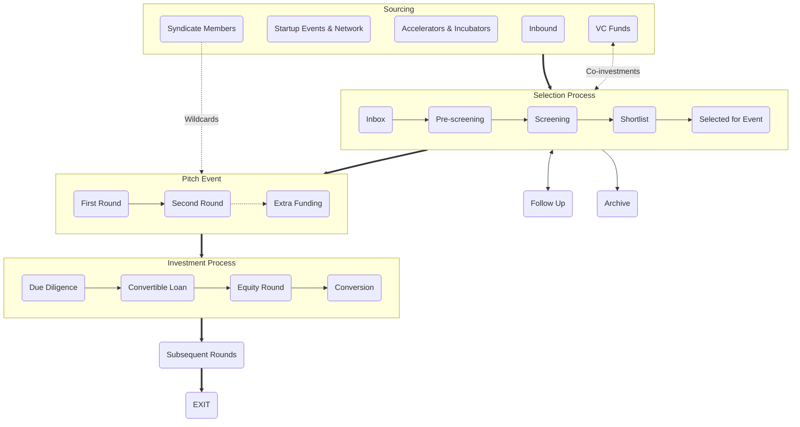

+++
title = "Jak investujeme?"
meta_title = "Jak investujeme?"
+++

V Gluon Syndicate věříme, že transparentní a předem jasný investiční proces společne s férovými podmínkami jsou základními předpoklady zrodu kvalitního vztahu mezi zakladateli startupu a jejich investory. A rádi se obklopujeme stejně smýšlejícími lidmi. Proto na tomto místě najdou potenciální zájemci o investíci, stejně jako investoři, kteří zvažují možnost se k nám přidat, vše podstatné o tom, jak přistupujeme k investování.

 

## Sourcing

### Syndicate Members
Naši členové mají možnost navrhovat startupy hledající investici a ty následně prochází našim výběrovým procesem. Navíc - investoři s prémiovým členstvím mají právo jednou ročně nominovat přímo na event jeden startup, do kterého chtějí investovat a hledají co-investory. 

### Startup Events & Network
Aktivně vyhledáváme nadějné startupy napříč střední a východní Evropou formou osobních setkání na startupistických eventech a soutěžích i prostřednictvím online průzkumu. A díky široké síti kontaktů z řad founderů, investorů, novinářů a dalších startup nadšenců, kterou jsme si za 15 let v byznysu vybudovali, zůstáváme v obraze o aktuálním dění na startupistické scéně v regionu.

### Accelerators & Incubators
Vytvořili jsme a rozvíjíme partnerství s několika regionálními akcelerátory a inkubátory (AceON, StartupYard, InQb, SaaS Garden, atd.), přičem v některých z nich i přímo mentorujeme. Díky této spolupráci získáváme přístup k jejich nejlepším alumni startupům.

### Inbound
Aktivně promujeme aktivity a fungování syndikátu s cílem zasáhnout zakladatele nejzajímavějších early-stage startupů z regionu. Snažíme sa jasně odkomunikovat své principy a výhody, abychom byli mezi prvními, komu pošlou svůj pitch deck, ve chvíli kdy začnou hledat angel investici.

### VC Funds
Jsme v blízkém kontaktu s předními VC fondy ze CEE (Presto, Tensor, Kaya, 0100, Zaka, atd.) a ty k nám směrují startupy z jejich deal flow, které jim připadají zajímavé, ale jsou pro ně příliš early-stage. Navíc s námi vybrané VCs pravidelně sdílejí zajímavé koinvestiční příležitosti a recipročně my máme možnost některé naše příležitosti sdílet s nimi.

---

## Selection

### Inbox
Každá nová příležitost nám přistane do inboxu, nejčastěji na základě online přihlášky u nás na webu. Snažíme sa, aby foundeři ještě před vyplněním přihlášky znali fungování Gluon Syndicate a podmínky, za kterých investujeme. Do další fáze posouváme projekty, které splňují základní investiční kriteria (fáze projektu, objem plánované investice, očekávání founders, apod.)

### Pre-screening
V první fázi výběrového procesu hodnotíme odpovědi na otázky z prihlášky ohledem problému a jeho řešení, trhu a konkurence, inovativnosti konceptu, síly týmu, biznis modelu, atd. Projekty, které na první pohled vyhodnotíme jako zajímavé, posunujeme do další fáze.

### Screening
V druhé fázi výběrového procesu jdeme významně více do detailu prezentovaného byznysu. Analýza se skládá z rozšířené sady otázek a odpovědí a 30-60 minutového callu se zakladateli startupu. Na základě zjištění vybíráme startupy na shortlist, přičem vždy měsíc před pitch eventem chceme mít na shortlistu 30 nejzajímavějších startupů, které jsme za poslední kvartál viděli.

### Shortlist
Z 30 shortlistovaných startupů vybíráme 15 nejlepších, které dostanou příležitost zabojovat o investici na pitch eventu. O nominaci na každý event rozhoduje bodovací hlasování zakladatelů a VIP členů Gluon Syndicate, které probíhá prostřednictvím vlastní online platformy. Nominace na event jsou známy 14 dní před jeho uskutečněním.

### Selected for event
Se startupy vybranými na event předem podepisujeme základní investiční dokumentaci - smlouvu o konvertibilní půjčce (CLA) - tak aby všechny podmínky byly jasné a zakotvené ještě před pitch eventem (nejdůležitější parametry naší standardizované CLA najdete zde). Součástí této smlouvy je aktivační klauzule, která spustí investiční proces za dohodnutých podmínek, pokud se zakladatelům startupu podaří na pitch eventu naraisovat prostředky v hodnotě investičního cíle, který si předem sami určí (v rozsahu €50-300k). 
NB: Startup za účast na eventu ani za případnou realizaci investice a s tím související činnosti neplatí žádné poplatky.

---

## Pitch Event

### First round
V prvej časti eventu majú postupne všetky startupy na stagi 5 minútový priestor na pitch. Okrem toho majú founderi od začiatku eventu k dispozícii vlastný prezentačný stánok. Od zahájenia eventu môžu všetci prítomní investori vyjadriť predbežný záujem investovať do konkrétneho startupu zadaním indikatívneho ticketu v konkrétnej výške do mobilnej aplikácie. Kvantifikovaný predbežný záujem o investície do všetkých startupov je vizualizovaný na displejoch. Na konci prvého kola sa vyhodnotí predbežný záujem a 6 startupov s najväčšou indikovanou sumou postupuje do druhého kola na stagi (nepostupujúce startupy naďalej môžu nariasovať počas eventu svoje ciele, len už nedostávajú ďalší priestor na stagi).

### Second round
V druhom kole dostáva 6 startupov s najvyššou sumou kvantifikovaného záujmu o investíciu príležitosť odprezentovať na stagi svoj biznis model (a prípadne aj produktové demo). Na konci každej prezentácie prebieha krátka Q&A session. Od začiatku druhého kola môžu investori konvertovať predbežný záujem na záväznú ponuku (a naďalej môžu aj ľubovoľne vyjadrovať a meniť predbežné záujmy). Vyjadrením záväznej ponuky získava startup prísľub investície od daného investora. Investor tento svoj commitment digitálne podpisuje prostredníctvom mobilnej aplikácie. Ak suma prísľubov na evente dosiahne, resp. prekročí hranicu investičného cieľa, ktorú si founderi zadefinovali, investícia sa bude realizovať. Ak sa počas eventu founderom nepodarí získať sumu záväzných ponúk na úrovni investičného cieľa, žiadna investícia sa nerealizuje a podpísaná CLA nevstúpi do platnosti ale zaniká.

### Extra funding
Founderi jednotlivých startupov si vopred určujú okrem svojho investičného cieľa (ktorý je zároveň tresholdom celej investície) aj možnosť naraisovať "extra funding" vo výške 0-100% investičného cieľa, teda možnosť až zdvojnásobiť investíciu. Ak úspešný startup dosiahne hranicu extra fundingu priamo na evente, investičná príležitosť sa uzatvára a už nie je možné do startupu ďalej investovať. Ak startup dosiahne na evente svoj investičný cieľ ale nedosiahne hranicu extra fundingu, ostane táto príležitosť otvorená pre angel investorov ešte 5 dní prostredníctvom mobilnej aplikácie (ak sa počas tohto obdobia naplní extra funding, príležitosť sa v danom momente zatvorí).
NB: Výška valuation cap v CLA je závislá od stanoveného investičného cieľa a extra funding na ňu nemá žiaden dodatočný vplyv. Preto sa founderi pred eventom musia rozhodnúť, či majú za daných podmienok záujem v prípade dosiahnutí cieľa raisovať aj extra funding a v akej výške.

---

## Investment

### Due Diligence (DD)
Ak sa startupu na evente podarí naraisovať vytýčený investičný cieľ (prípadne aj voliteľný extra funding), zaháji sa bezprostredne po evente (resp. po ukončenia obdobia určeného pre extra funding) ostrá fáza investičného procesu. Tá začína základným due diligence - teda overením skutočností, ktoré founderi uviedli v priebehu procesu výberu. To trvá zpravidla niekoľko dní. Vo fáze early-stage investícií nie je DD proces taký obsiahly a detailný ako v neskorších investičných kolách a kontrolujú sa najmä bazálne prerekvizity (corporate governance, cap table, dôležité zmluvné záväzky startupu, forma ošetrenia IP a prípadne deklarovaná existujúca trakcia).

### Convertible Loan
Ak sú výsledky DD uspokojivé, Gluon Syndicate vytvára v spolupráci so všetkými zúčastnenými angel investormi SPV (spoločnost určenú výhradne na investovanie do daného startupu), na ktorú sa následne prenesie aktivovaná CLA. Angel investori vkladajú sumy určené na investíciu do cieľového startupu do novovzniknutej SPV formou vkladu do základného imania a kapitálových fondov a získavajú za to alikvotný podiel na SPV. Následne SPV posiela na základe CLA peniaze cieľovému startupu a stáva sa tak v prvej fáze jeho veriteľom. Od momentu odoslania peňazí cieľovému startupu sa stávajú zapojení angel investori (zastupovaní Gluon Syndicate) investormi v cieľovom startupe a spúšťa sa tak štandardná investorsko-founderská spolupráca (kvartálny reporting, pravideľný board meeting za účasti zástupcov investora, mentoring a biznisová pomoc angelov, atď.)

### Equity round
Spoločným cieľom zakladateľov aj angel investorov je okrem iného aj realizácia kvalifikovaného investičného (equity) kola, teda príchod inštitucionalizovaných VC investorov do startupu (ideálne v horizonte niekoľkých mesiacov až 1-2 rokov od angel investície). Gluon Syndicate ako skupina motivovaných angel investorov bude zakladateľom startupu aktívne pomáhať aj v získaní tejto prvej VC investície - prepojením na relevantné VC fondy z regiónu, predstavením a otvorením dverí k rôznym fundraisingovým príležitostiam, pomocou pri výbere správnych investorov aj negociácii podmienok, atď.). V niektorých prípadoch sa v rámci nasledujúceho investičného kola, po dohode so zakladateľmi a novými investormi, môže ku novej investícii pridať aj SPV zastupované Gluon Syndicate a navýšiť tak svoju investíciu v cieľovom startupe.

### Conversion
Ak sa zakladateľom startupu podarí uzatvoriť kvalifikované investičné kolo, SPV konvertuje pri tejto príležitosti svoj úver na equity (na základe podmienok definovaných v CLA). Ku takejto konverzii úveru na podieľ v cieľovom startupe môže dojsť za špecifických podmienok aj na základe uplynutia časového obdobia definovaného v CLA (v prípade, že sa počas tohto obdobia nepodarí uzatvoriť nasledujúce kvalifikované investičné kolo). Od okamihu konverzie sa SPV stáva plnohodnotným spoločníkom v cieľovom startupe.

---

## Subsequent rounds
V prípade, že sa cieľovému startupu podarí uzatvoriť ďalšie investičné kola, SPV zastúpená Gluon Syndicate sa týchto nasledujucích kôl zúčastňuje ako štandardný early-stage investor (vyjednáva s pristupujucími investormi, uplatňuje si svoje práva a pomáha zakladateľom s nastavením fundraisingovej stratégie).

---

## Exit
Pre Gluon Syndicate a zúčastnených angel investorov - rovnako ako pre každého investora na VC trhu - je primárnou motiváciou investície do startupu potenciálny exit. Základnou stratégiou GS je ostať na palube startupu až do akvizície spoločnosti strategickým investorom alebo do IPO, preto je predpokladaným investičným horizontom v prípade úspešných investícií obdobie cca. 7-15 rokov. V niektorých prípadoch, ak to dáva zmysel pre strategické smerovanie spoločnosti, môže byť podieľ na cieľovom startupe čiastočne alebo úplne predaný novovstupujúcemu alebo inému existujúcemu investorovi, napríklad v rámci niektorého nasledujúceho investičného kola alebo podobne.