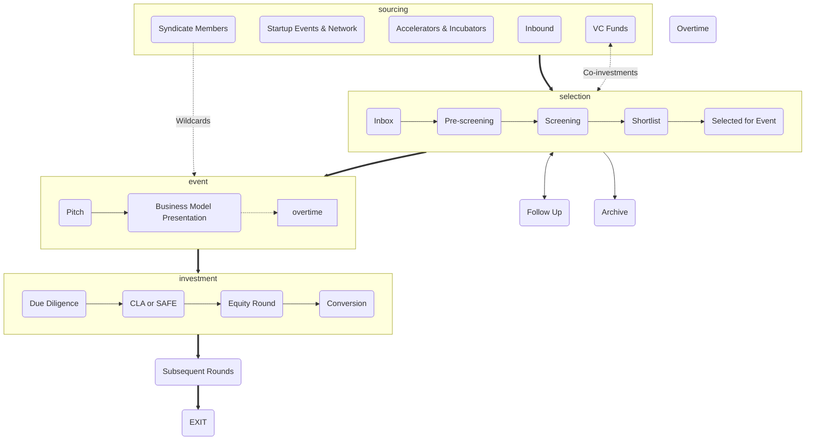

+++
title = "How We Invest?"
categories = [ "For Startups", "For Investors",]
tags = [ "process", "conditions", "policy", "raising capital", "sourcing", "selection", "event", "investment",]
meta_title = "How We Invest?"
+++

Gluon Syndicate’s investment process is designed to foster transparency, fairness, and efficiency while aligning the interests of both founders and investors. Whether you are a founder seeking funding or an investor exploring opportunities, our structured process ensures clarity and value at every step. Here’s a high-level breakdown:

1. **[Sourcing](https://kb.gluon.vc/Knowledge+Base/How+We+Invest/Sourcing)**: We source startups from diverse channels, including inbound applications, startup events, partnerships with accelerators and incubators, referrals from syndicate members, and connections with VC funds.
2. **[Selection](https://kb.gluon.vc/Knowledge+Base/How+We+Invest/Selection)**: Startups go through a thorough evaluation process, including pre-screening, screening, and shortlisting, before being selected to pitch at one of our quarterly pitch events.
3. **[Pitch Events](https://kb.gluon.vc/Knowledge+Base/How+We+Invest/Pitch+Events)**: Startups present their vision and goals in a two-round pitch event, where investors express interest and make commitments using our streamlined app.
4. **[Investment](https://kb.gluon.vc/Knowledge+Base/How+We+Invest/Investment)**: Startups that meet their funding goals enter due diligence, after which investments are made through either [[CLA (Convertible Loan Agreement)]] or [[SAFE (Simple Agreement for Future Equity)]].
5. **[Subsequent Rounds and Exit](https://kb.gluon.vc/Knowledge+Base/How+We+Invest/Subsequent+Rounds+and+Exit)**: We support startups as they grow and secure future funding, leveraging our network to connect them with institutional investors. Our goal is a successful exit, whether through acquisition, IPO, or other strategic opportunities, with a typical investment horizon of 7-10 years.

 

You can find more information in our **[Knowledge Base](https://kb.gluon.vc/)**


---