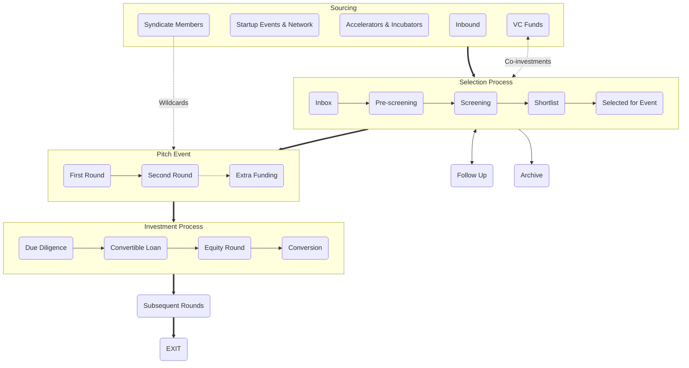

+++
title = "How We Invest?"
categories = [ "For Startups", "For Investors",]
tags = [ "process", "conditions", "policy", "raising capital", "sourcing", "selection", "event", "investment",]
meta_title = "How We Invest?"
+++

At Gluon Syndicate, we believe that a transparent and clear investment process together with fair conditions are the basic prerequisites for the beginning of a quality relationship between startup founders and their investors. And we like to surround ourselves with like-minded people. Therefore, whether you are a founder seeking investment, or an investor considering joining us, here you can find everything important about how we approach investing.

 

## Sourcing

### Syndicate Members
Our members have the opportunity to propose startups looking for investment which then go through our selection process. In addition, investors with a premium membership can nominate directly to the event a startup in which they want to invest and are looking for co-investors (every premium member has one wildcard per year).

### Startup Events & Network
We actively source promising startups across Central and Eastern Europe using in-person meetings at startup events and competitions as well as online research. And thanks to the wide network of founders, investors, journalists, and other startup enthusiasts, which we have built up over 15 years in business, we stay up-to-date on the startup scene in the region.

### Accelerators & Incubators
We have created partnerships with several regional accelerators and incubators (AceON, StartupYard, InQb, SaaS Garden, etc.) and we are also mentors in some of them. Thanks to this cooperation, we get access to their best alumni startups.

### Inbound
We actively promote the activities and functioning of the syndicate intending to reach the founders of the most interesting early-stage startups from the region. We strive to communicate our principles and benefits so that we are among the first to whom they send their pitch deck when they start looking for angel investment.

### VC Funds
We are in close contact with leading VC funds from CEE (Presto, Tensor, Kaya, 0100, Zaka, etc.) and they are sending us startups from their deal flow that they find interesting, but are too early-stage for them. In addition, selected VCs regularly share interesting co-investment opportunities with us, and reciprocally we have the opportunity to share some of our opportunities with them.

---

## Selection

### Inbox
Every new opportunity lands in our inbox, most often based on an online application on our website. We try to ensure that founders know how Gluon Syndicate works (and what are the conditions under which we invest) before filling out the application. We advance projects that meet the basic investment criteria to the next phase (project phase, volume of planned investment, founders' expectations, etc.)

### Pre-screening
In the first stage of the selection process, we evaluate the answers to the questions from the application concerning the problem and its solution, the market and competition, the innovativeness of the concept, the strength of the team, the business model, etc. Projects that we evaluate as interesting at first glance are moved to the next stage.

### Screening
In the second phase of the selection process, we go significantly more into the details of the presented business. The analysis consists of an extended set of questions and answers and a 30 to 60-minute call with the founders of the startup. Based on the findings, we select startups for the shortlist. A month before each pitch event, we want to have the 30 most interesting startups that we have seen in the last quarter on the shortlist.

### Shortlist
From the 30 shortlisted startups, we select the 15 best, which will get the opportunity to fight for investment at the pitch event. The nomination for each event is decided by a points vote of the founders and VIP members of the Gluon Syndicate, which takes place through its online platform. Nominations for the event are known 14 days before it takes place.

### Selected for event
With startups selected for the event, we sign basic investment documentation in advance - a convertible loan agreement (CLA) - so that all conditions are clear and established before the pitch event (you can find the most important parameters of our standardized CLA here). Part of this contract is an activation clause, which will start the investment process under agreed conditions in case the startup founders manage to raise funds at the pitch event in the amount of the investment goal, which they determine in advance (in the range of €50-300k).
NB: The startup does not pay any fees for participating in the event or for the possible realization of the investment and related activities.

---

## Pitch Event

### First round
In the first part of the event, all startups have a 5-minute pitch on the stage. In addition, the founders have their presentation booths available from the start of the event. From the start of the event, all present investors can express a preliminary interest in investing in a specific startup by entering an indicative ticket (specific amount) into the mobile application. Quantified preliminary investment interest in all startups is visualized on the displays. At the end of the first round, the preliminary interest is evaluated and the 6 startups with the largest indicated amount advance to the second round for the stage (non-advancing startups can still raise their goals during the event, but they no longer receive additional stage opportunities).

### Second round
In the second round, 6 startups with the highest amount of quantified investment interest get the 20-minute opportunity to present their business model (and possibly a product demo) at the stage. At the end of each presentation, there is a short Q&A session. From the beginning of the second round, investors can convert preliminary interest into a binding offer (and they can continue to express and adjust their preliminary interests). By expressing a binding offer, the startup obtains a promise of investment from the given investor. The investor digitally signs this commitment via a mobile application. If the amount of commitments at the event reaches or exceeds the limit of the investment goal defined by the founders, the investment will be realized. If the founders fail to obtain the amount of commitments at the level of the investment goal, no investment will be made and the signed CLA will not enter into force, but expire.

### Extra funding
The founders of startups determine in advance, in addition to their investment goal (which is also the threshold value of the entire investment), the possibility of raising "extra funding" in the amount of 0-100% of the investment goal, i.e. the possibility of doubling the investment. If a successful startup reaches also the extra funding goal directly at the event, the investment opportunity is closed and it is no longer possible to invest in the startup. If a startup reaches its basic investment goal at the event but does not reach the extra funding goal, the opportunity will remain open to angel investors for another 5 days via the mobile app (if the extra funding goal is met during this period, the opportunity will close at that point).
NB: The value of the valuation cap in CLA depends on the set investment goal and the amount of extra funding has no additional effect on it. Therefore, the founders must decide before the event whether, under the given conditions, they are interested in raising extra funding if the goal is achieved, and in what amount.

---

## Investment

### Due Diligence (DD)
If the startup succeeds in raising the investment goal (or optional the extra funding) at the event, the intensive phase of the investment process will begin immediately after the event (or after the end of the short period designated for extra funding). It starts with basic due diligence – i.e. verifying the facts that the founders stated during the selection process. This usually takes several days. In the phase of early-stage investments, the DD process is not as extensive and detailed as in later investment rounds, and the basic prerequisites are checked in particular (corporate governance, cap table, important contractual obligations of the startup, form of IP treatment and, if applicable, declared existing traction).

### Convertible Loan
If the DD results are satisfactory, the Gluon Syndicate, in cooperation with all participating angel investors, creates an SPV (a company dedicated exclusively to investing in the given startup), to which the activated CLA is subsequently transferred. Angel investors deposit amounts intended for investment in the target startup into the newly created SPV in the form of a contribution to the capital stock and capital funds and receive an aliquot share of the SPV. Subsequently, the SPV sends money to the target startup based on the CLA and thus becomes its creditor in the first phase. From the moment the money is sent to the target startup, the involved angel investors (represented by Gluon Syndicate) become investors in the target startup, and standard investor-founder cooperation starts (quarterly reporting, regular board meetings with the participation of the investor's representatives, mentoring and business assistance from angels, etc.).

### Equity round
The common goal of founders and angel investors is, among other things, the realization of a qualified investment (equity) round, i.e. finding institutional VC investors for the startup (ideally within a period of several months to 1-2 years from the angel investment). Gluon Syndicate, as a group of motivated angel investors, will actively help startup founders obtain this first VC investment - by connecting them to relevant VC funds from the region, introducing and opening doors to various fundraising opportunities, helping them choose the right investors and negotiating terms, etc.). In some cases, as part of the next investment round, after agreement with the founders and new investors, the SPV represented by Gluon Syndicate can join the new investment and thus increase its investment in the target startup.

### Conversion
If the founders of the startup manage to close a qualified investment round, the SPV converts its loan to equity on this occasion (based on the conditions defined in the CLA). Such a conversion of the loan to an equity share in the target startup can take place under specific conditions and based on the expiration of the period defined in the CLA (if the next qualified investment round cannot be closed during this period). From the moment of conversion, the SPV becomes a shareholder in the target startup.

---

## Subsequent rounds
If the target startup succeeds in concluding further investment rounds, the SPV represented by Gluon Syndicate participates in these subsequent rounds as a standard early-stage investor (negotiates with the approaching investors, exercises its rights, and helps the founders set up the fundraising strategy).

---

## Exit
For the Gluon Syndicate and the participating angel investors – as for any investor in the VC market – the primary motivation for investing in a startup is the potential exit. The basic strategy of Gluon Syndicate is to stay on board the startup until the acquisition of the company by a strategic investor or until the IPO, therefore the expected investment horizon in the case of successful investments is a period of approx. 7-15 years. In some cases, if it makes sense for the strategic direction of the company, the share in the target startup can be partially or completely sold to a new entrant or another existing investor, for example in a subsequent investment round or similar.