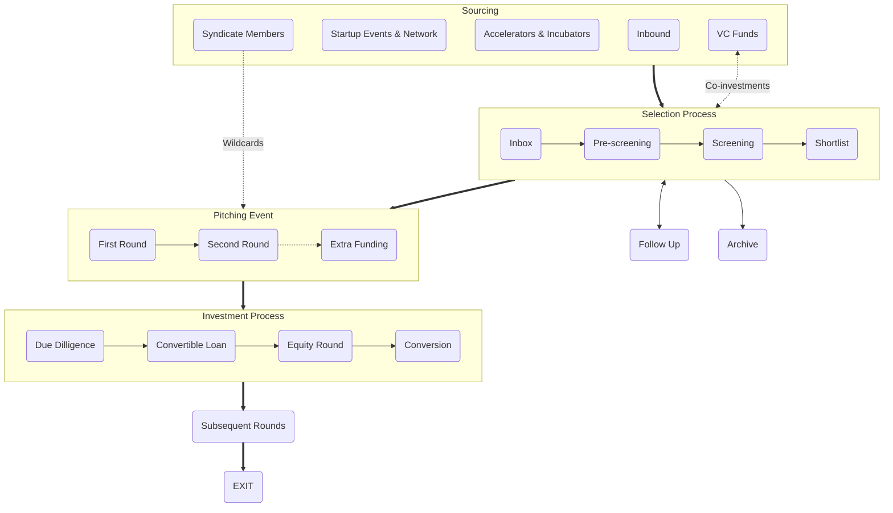

+++
title = "How We Invest"
meta_title = "How We Invest"
+++

 

## Selection

### Inbox

Každá nová príležitosť nám pristane do inboxu, najčastejšie na základe online prihlášky u nás na webe. Snažíme sa, aby founderi ešte pred vyplnením prihlášky poznali fungovanie Gluon Syndicate a podmienky, za akých investujeme. Do ďalšej fázy posúvame projekty, ktoré spĺňajú základné investičné kritériá (fáza projektu, veľkosť potrebnej investície, očakávania founders)

### Pre-screening

V prvej fáze výberového procesu hodnotíme odpovede na otázky z prihlášky ohľadom problému a riešenia, trhu a konkurencie, inovatívnosti konceptu, sily týmu a biznis modelu, atď. Projekty, ktoré vyhodnotíme ako zaujímavé posunujeme do ďalšej fázy.

### Screening

V druhej fáze výberového procesu ideme významne viacej do detailu prezentovaného biznisu. Analýza pozostáva z rozšírenej sady otázok a odpovedí a 30-60 minútového callu s foundermi startupu. Na základe zistení vyberáme startupy na shortlist, pričom vždy mesiac pred pitch eventom chceme mať na shortliste 30 najzaujímavejších startupov, ktoré sme za posledný kvartál videli.

### Shortlist

Z 30 shortlistovaných startupov vyberáme 15 najlepších, ktoré dostanú príležitosť zabojovať o investíciu na pitch evente. O nominácii na každý event rozhoduje bodovacie hlasovanie zakladateľov a VIP členovi Gluon Syndicate, ktoré prebieha prostredníctvom vlastnej online platformy. Nominácie na event sú známe 14 dní pred jeho uskutočnením.

## Event  

### First Round 

V prvej časti eventu majú postupne všetky startupy na stagi 5 minútový priestor na pitch. Okrem toho majú founderi od začiatku eventu k dispozícii vlastný prezentačný stánok. Od štartu eventu môžu všetci prítomní investori vyjadriť predbežný záujem investovať do konkrétneho startupu zadaním predbežného ticketu v konkrétnej výške do mobilnej aplikácie. Kvantifikovaný predbežný záujem o investície do všetkých startupov je vizualizovaný na displejoch. Na konci prvého kola sa vyhodnotí predbežný záujem a 6 startupov s najväčšou sumou postupuje do druhého kola na stagi (nepostupujúce startupy naďalej môžu nariasovať počas eventu svoje ciele, len už nedostávajú ďalší priestor na stagi).

### Second Round

V druhom kole dostáva 6 startupov s najvyššou sumou kvantifikovaného záujmu o investíciu príležitosť odprezentovať na stagi svoj biznis model (a prípadne aj produktové demo). Na konci každej prezentácie prebieha krátka Q&A session. Od začiatku druhého kola môžu investori  konvertovať predbežný záujem na záväznú ponuku (a naďalej ľubovoľne  vyjadrovať a meniť predbežné záujmy). Vyjadrením záväznej ponuky získava startup prísĺub investície od daného investora. Ak suma prísľubov na evente dosiahne, resp. prekročí hranicu investičného cieľa, ktorú si founderi definovali, investícia sa bude realizovať. Ak sa počas eventu founderom nepodarí získať sumu záväzných ponúk na úrovni investičného cieľa, žiadna investícia sa nerealizuje.

### Extra Funding

Founderi jednotlivých startupov si vopred určujú okrem svojho investičného cieľa (ktorý je zároveň tresholdom celej investície) aj možnosť naraisovať "extra funding" vo výške 0-100% investičného cieľa, teda možnosť až zdvojnásobiť investíciu. Ak úspešný startup dosiahne hranicu extra fundingu priamo na evente, investičná príležitosť sa uzatvára a už nie je možné do startupu ďalej investovať. Ak startup dosiahne na evente svoj investičný cieľ ale nedosiahne hranicu extra fundingu, ostane táto príležitosť otvorená pre angel investorov ešte 5 dní prostredníctvom mobilnej aplikácie (ak sa počas tohto obdobia naplní extra funding, príležitosť sa zatvorí).