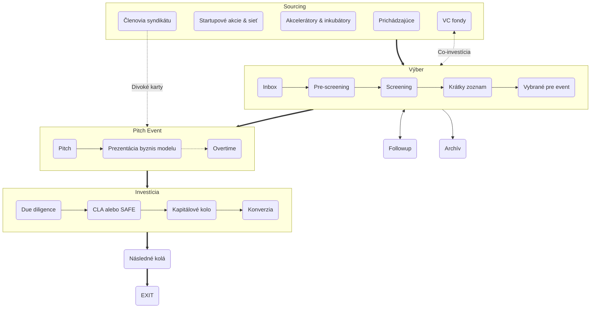

+++
title = "Ako investujeme?"
meta_title = "Ako investujeme?"
+++

Investičný proces Gluon Syndicate je navrhnutý tak, aby podporoval transparentnosť, spravodlivosť a efektivitu, pričom zlaďuje záujmy zakladateľov aj investorov. Či už ste zakladateľ hľadajúci financovanie alebo investor skúmajúci príležitosti, náš štruktúrovaný proces zabezpečuje jasnosť a hodnotu v každom kroku. Tu je jeho základný prehľad:

#### 1. [Sourcing](https://kb.gluon.vc/Knowledge+Base/How+We+Invest/Sourcing)

Startupy získavame z rôznych kanálov, vrátane prichádzajúcich žiadostí, startupových udalostí, partnerstiev s akcelerátormi a inkubátormi, odporúčaní od členov syndikátu a prepojení s VC fondmi.

#### 2. [Výber](https://kb.gluon.vc/Knowledge+Base/How+We+Invest/Selection)

Startupy prechádzajú dôkladným hodnotiacim procesom, ktorý zahŕňa predbežný screening, screening a vytvorenie užšieho zoznamu pred výberom na prezentáciu na jednej z našich štvrťročných pitch udalostí.

#### 3. [Pitch Events](https://kb.gluon.vc/Knowledge+Base/How+We+Invest/Pitch+Events)

Startupy predstavujú svoju víziu a ciele v dvojkolovej prezentácii, kde investori prejavujú záujem a robia záväzky prostredníctvom našej aplikácie.

#### 4. [Investícia](https://kb.gluon.vc/Knowledge+Base/How+We+Invest/Investment)

Startupy, ktoré dosiahnu svoje investičné ciele, prechádzajú due diligence, po ktorej sú investície realizované buď prostredníctvom [CLA (Convertible Loan Agreement)](https://kb.gluon.vc/Knowledge+Base/CLA+(Convertible+Loan+Agreement)) alebo [SAFE (Simple Agreement for Future Equity)](https://kb.gluon.vc/Knowledge+Base/SAFE+(Simple+Agreement+for+Future+Equity)).

#### 5. [Následné kolá a exit](https://kb.gluon.vc/Knowledge+Base/How+We+Invest/Subsequent+Rounds+and+Exit)

Podporujeme startupy v ich raste a zabezpečení budúceho financovania, pričom využívame našu sieť na ich prepojenie s inštitucionálnymi investormi. Naším cieľom je úspešný exit, či už akvizíciou, IPO alebo inými strategickými príležitosťami, s obvyklým investičným horizontom 7–10 rokov.


Podrobný popis každej fázy nájdete v našej **[Znalostnej báze (EN)](https://kb.gluon.vc/)**


---