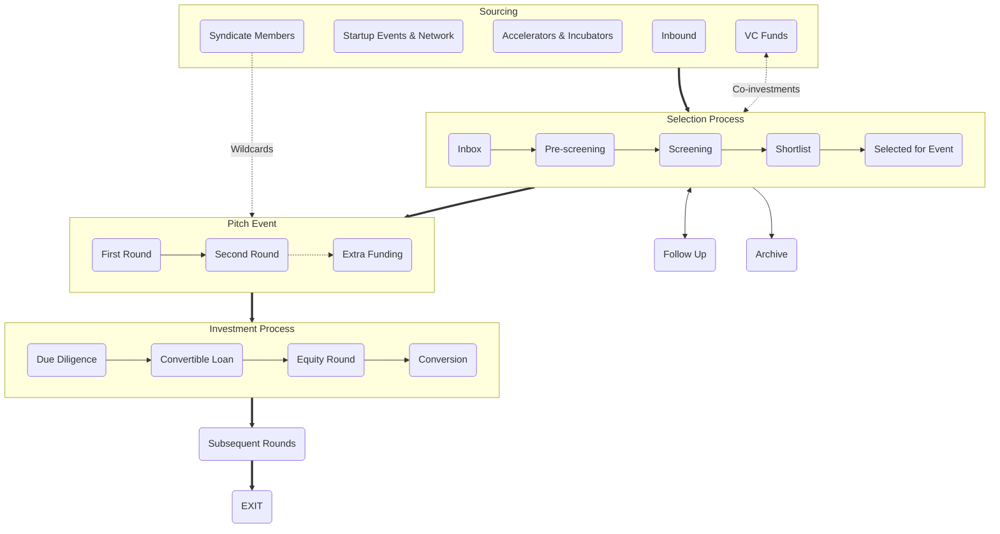

+++
title = "Ako investujeme?"
meta_title = "Ako investujeme?"
+++

V Gluon Syndicate veríme, že transparentný a vopred jasný investičný proces spolu s férovými podmienkami sú základnými predpokladmi vzniku kvalitného vzťahu medzi zakladateľmi startupu a ich investormi. A radi sa obklopujeme rovnako zmýšľajúcimi ľuďmi. Preto na tomto mieste nájdu potenciálni záujemcovia o investíciu, ako aj investori, ktorí zvažujú možnosť sa ku nám pridať, všetko podstatné o tom, ako pristupujeme ku investovaniu.

 

## Sourcing

### Syndicate Members
Naši členovia majú možnosť navrhovať startupy hľadajúce investíciu, ktoré následne prechádzajú našim výberovým procesom. Navyše - investori s prémiovým členstvom majú právo raz ročne nominovať priamo na event jeden startup, do ktorého chcú investovať a hľadajú co-investorov. 

### Startup Events & Network
Aktívne vyhľadávame nádejné startupy naprieč strednou a východnou Európou formou osobných stretnutí na startupistických eventoch a súťažiach aj prostredníctvom online prieskumu. A vďaka širokej sieti kontaktov z radov founderov, investorov, novinárov a ďalších startup entuziastov, ktorú sme si za 15 rokov v biznise vybudovali, ostávame v obraze ohľadom aktuálneho diania na startupistickej scéne v regióne.

### Accelerators & Incubators
Vytvorili sme a rozvíjame partnerstvá s akcelerátormi a inkubátormi v regióne (AceON, StartupYard, InQb, SaaS Garden, atď.), pričom v niektorých z nich aj priamo mentorujeme. Vďaka tejto spolupráci získavame prístup k ich najlepším alumni startupom.

### Inbound
Aktívne promujeme aktivity a fungovanie syndikátu s cieľom zasiahnuť zakľadateľov najzaujímavejších early-stage startupov z regiónu. Snažíme sa jasne odkomunikovať svoje princípy a výhody, aby sme boli medzi prvými, komu pošlú svoj pitch deck, keď začnú hľadať angel investíciu.

### VC Funds
Sme v blízkom kontakte s poprednými VC fondami zo CEE ((Presto, Tensor, Kaya, 0100, Zaka, atď.), ktoré ku nám smerujú startupy z ich deal flow, ktoré im prídu zaujímavé, ale sú pre nich príliš early-stage. A navyše s nami vybrané VCs pravideľne zdieľajú zaujímavé co-investičné príležitosti a recipročne my máme možnosť niektoré naše príležitosti zdieľať s nimi.

---

## Selection

### Inbox
Každá nová príležitosť nám pristane do inboxu, najčastejšie na základe online prihlášky u nás na webe. Snažíme sa, aby founderi ešte pred vyplnením prihlášky poznali fungovanie Gluon Syndicate a podmienky, za akých investujeme. Do ďalšej fázy posúvame projekty, ktoré spĺňajú základné investičné kritériá (fáza projektu, veľkosť potrebnej investície, očakávania founderov, apod.)

### Pre-screening
V prvej fáze výberového procesu hodnotíme odpovede na otázky z prihlášky ohľadom problému a jeho riešenia, trhu a konkurencie, inovatívnosti konceptu, sily týmu, biznis modelu, atď. Projekty, ktoré na prvý pohľad vyhodnotíme ako zaujímavé, posunujeme do ďalšej fázy.

### Screening
V druhej fáze výberového procesu ideme významne viacej do detailu prezentovaného biznisu. Analýza pozostáva z rozšírenej sady otázok a odpovedí a 30-60 minútového callu s foundermi startupu. Na základe zistení vyberáme startupy na shortlist, pričom vždy mesiac pred pitch eventom chceme mať na shortliste 30 najzaujímavejších startupov, ktoré sme za posledný kvartál videli.

### Shortlist
Z 30 shortlistovaných startupov vyberáme 15 najlepších, ktoré dostanú príležitosť zabojovať o investíciu na pitch evente. O nominácii na každý event rozhoduje bodovacie hlasovanie zakladateľov a VIP členov Gluon Syndicate, ktoré prebieha prostredníctvom vlastnej online platformy. Nominácie na event sú známe 14 dní pred jeho uskutočnením.

### Selected for event
So startupmi vybranými na event vopred podpisujeme základnú investičnú dokumentáciu - zmluvu o konvertibilnom úvere (CLA) - tak aby všetky podmienky boli jasné a zakotvené ešte pred pitch eventom (najdôležitejšie parametre našej CLA nájdete tu). Súčasťou tejto zmluvy je aktivačná klauzula, ktorá spustí investičný proces za dohodnutých podmienok, ak sa zakladateľom startupu podarí na pitch evente naraisovať prostriedky v hodnote investičného cieľa, ktorý si vopred sami určia (v rozsahu €50-300k). 
NB: Startup za účasť na evente ani za prípadnú realizáciu investície a s tým súvisiace činnosti neplatí žiadne poplatky.

---

## Pitch Event

### First round
V prvej časti eventu majú postupne všetky startupy na stagi 5 minútový priestor na pitch. Okrem toho majú founderi od začiatku eventu k dispozícii vlastný prezentačný stánok. Od zahájenia eventu môžu všetci prítomní investori vyjadriť predbežný záujem investovať do konkrétneho startupu zadaním indikatívneho ticketu v konkrétnej výške do mobilnej aplikácie. Kvantifikovaný predbežný záujem o investície do všetkých startupov je vizualizovaný na displejoch. Na konci prvého kola sa vyhodnotí predbežný záujem a 6 startupov s najväčšou indikovanou sumou postupuje do druhého kola na stagi (nepostupujúce startupy naďalej môžu nariasovať počas eventu svoje ciele, len už nedostávajú ďalší priestor na stagi).

### Second round
V druhom kole dostáva 6 startupov s najvyššou sumou kvantifikovaného záujmu o investíciu príležitosť odprezentovať na stagi svoj biznis model (a prípadne aj produktové demo). Na konci každej prezentácie prebieha krátka Q&A session. Od začiatku druhého kola môžu investori konvertovať predbežný záujem na záväznú ponuku (a naďalej môžu aj ľubovoľne vyjadrovať a meniť predbežné záujmy). Vyjadrením záväznej ponuky získava startup prísľub investície od daného investora. Investor tento svoj commitment digitálne podpisuje prostredníctvom mobilnej aplikácie. Ak suma prísľubov na evente dosiahne, resp. prekročí hranicu investičného cieľa, ktorú si founderi zadefinovali, investícia sa bude realizovať. Ak sa počas eventu founderom nepodarí získať sumu záväzných ponúk na úrovni investičného cieľa, žiadna investícia sa nerealizuje a podpísaná CLA nevstúpi do platnosti ale zaniká.

### Extra funding
Founderi jednotlivých startupov si vopred určujú okrem svojho investičného cieľa (ktorý je zároveň tresholdom celej investície) aj možnosť naraisovať "extra funding" vo výške 0-100% investičného cieľa, teda možnosť až zdvojnásobiť investíciu. Ak úspešný startup dosiahne hranicu extra fundingu priamo na evente, investičná príležitosť sa uzatvára a už nie je možné do startupu ďalej investovať. Ak startup dosiahne na evente svoj investičný cieľ ale nedosiahne hranicu extra fundingu, ostane táto príležitosť otvorená pre angel investorov ešte 5 dní prostredníctvom mobilnej aplikácie (ak sa počas tohto obdobia naplní extra funding, príležitosť sa v danom momente zatvorí).
NB: Výška valuation cap v CLA je závislá od stanoveného investičného cieľa a extra funding na ňu nemá žiaden dodatočný vplyv. Preto sa founderi pred eventom musia rozhodnúť, či majú za daných podmienok záujem v prípade dosiahnutí cieľa raisovať aj extra funding a v akej výške.

---

## Investment

### Due Diligence (DD)
Ak sa startupu na evente podarí naraisovať vytýčený investičný cieľ (prípadne aj voliteľný extra funding), zaháji sa bezprostredne po evente (resp. po ukončenia obdobia určeného pre extra funding) ostrá fáza investičného procesu. Tá začína základným due diligence - teda overením skutočností, ktoré founderi uviedli v priebehu procesu výberu. To trvá zpravidla niekoľko dní. Vo fáze early-stage investícií nie je DD proces taký obsiahly a detailný ako v neskorších investičných kolách a kontrolujú sa najmä bazálne prerekvizity (corporate governance, cap table, dôležité zmluvné záväzky startupu, forma ošetrenia IP a prípadne deklarovaná existujúca trakcia).

### Convertible Loan
Ak sú výsledky DD uspokojivé, Gluon Syndicate vytvára v spolupráci so všetkými zúčastnenými angel investormi SPV (spoločnost určenú výhradne na investovanie do daného startupu), na ktorú sa následne prenesie aktivovaná CLA. Angel investori vkladajú sumy určené na investíciu do cieľového startupu do novovzniknutej SPV formou vkladu do základného imania a kapitálových fondov a získavajú za to alikvotný podiel na SPV. Následne SPV posiela na základe CLA peniaze cieľovému startupu a stáva sa tak v prvej fáze jeho veriteľom. Od momentu odoslania peňazí cieľovému startupu sa stávajú zapojení angel investori (zastupovaní Gluon Syndicate) investormi v cieľovom startupe a spúšťa sa tak štandardná investorsko-founderská spolupráca (kvartálny reporting, pravideľný board meeting za účasti zástupcov investora, mentoring a biznisová pomoc angelov, atď.)

### Equity round
Spoločným cieľom zakladateľov aj angel investorov je okrem iného aj realizácia kvalifikovaného investičného (equity) kola, teda príchod inštitucionalizovaných VC investorov do startupu (ideálne v horizonte niekoľkých mesiacov až 1-2 rokov od angel investície). Gluon Syndicate ako skupina motivovaných angel investorov bude zakladateľom startupu aktívne pomáhať aj v získaní tejto prvej VC investície - prepojením na relevantné VC fondy z regiónu, predstavením a otvorením dverí k rôznym fundraisingovým príležitostiam, pomocou pri výbere správnych investorov aj negociácii podmienok, atď.). V niektorých prípadoch sa v rámci nasledujúceho investičného kola, po dohode so zakladateľmi a novými investormi, môže ku novej investícii pridať aj SPV zastupované Gluon Syndicate a navýšiť tak svoju investíciu v cieľovom startupe.

### Conversion
Ak sa zakladateľom startupu podarí uzatvoriť kvalifikované investičné kolo, SPV konvertuje pri tejto príležitosti svoj úver na equity (na základe podmienok definovaných v CLA). Ku takejto konverzii úveru na podieľ v cieľovom startupe môže dojsť za špecifických podmienok aj na základe uplynutia časového obdobia definovaného v CLA (v prípade, že sa počas tohto obdobia nepodarí uzatvoriť nasledujúce kvalifikované investičné kolo). Od okamihu konverzie sa SPV stáva plnohodnotným spoločníkom v cieľovom startupe.

---

## Subsequent rounds
V prípade, že sa cieľovému startupu podarí uzatvoriť ďalšie investičné kola, SPV zastúpená Gluon Syndicate sa týchto nasledujucích kôl zúčastňuje ako štandardný early-stage investor (vyjednáva s pristupujucími investormi, uplatňuje si svoje práva a pomáha zakladateľom s nastavením fundraisingovej stratégie).

---

## Exit
Pre Gluon Syndicate a zúčastnených angel investorov - rovnako ako pre každého investora na VC trhu - je primárnou motiváciou investície do startupu potenciálny exit. Základnou stratégiou GS je ostať na palube startupu až do akvizície spoločnosti strategickým investorom alebo do IPO, preto je predpokladaným investičným horizontom v prípade úspešných investícií obdobie cca. 7-15 rokov. V niektorých prípadoch, ak to dáva zmysel pre strategické smerovanie spoločnosti, môže byť podieľ na cieľovom startupe čiastočne alebo úplne predaný novovstupujúcemu alebo inému existujúcemu investorovi, napríklad v rámci niektorého nasledujúceho investičného kola alebo podobne.